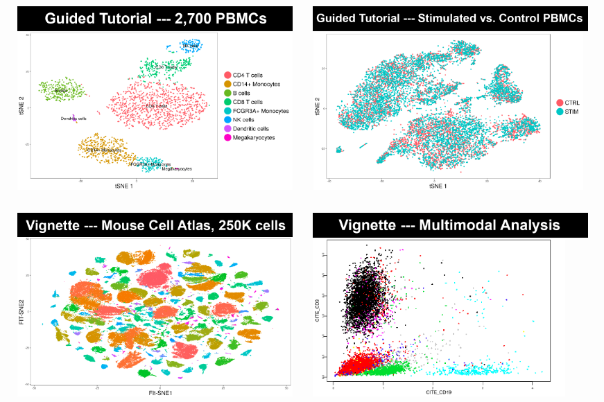

# SingleCellSeq
Single Cell Sequencing

This is an implementation of the Seurat single cell sequencing

 The input to Seurat is a gene expression matrix (download from [here](https://s3-us-west-2.amazonaws.com/10x.files/samples/cell/pbmc3k/pbmc3k_filtered_gene_bc_matrices.tar.gz) ), where the rows are genes and the columns are single cells. 
 
 This program additionally creates a csv file of the matrix which is otherwise unreadable. 
 
 
 
 Installation instructions to install Seurat can be found here https://satijalab.org/seurat/install.html
 
 
 
 
